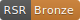
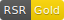
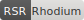
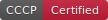

# RSR Certification Badges

## Usage

### Markdown

```markdown

```

### AsciiDoc

```asciidoc
image:https://raw.githubusercontent.com/hyperpolymath/rhodium-standard-repositories/main/badges/rsr-gold.svg[RSR Gold]
```

### HTML

```html

```

### shields.io (Dynamic)

```markdown


```

## Available Badges

| Tier | Score | Badge | File |
|------|-------|-------|------|
| Bronze | 75-89% |  | `rsr-bronze.svg` |
| Silver | 90-99% |  | `rsr-silver.svg` |
| Gold | 100% |  | `rsr-gold.svg` |
| Rhodium | 100%+ |  | `rsr-rhodium.svg` |
| CCCP | Language Policy |  | `cccp-certified.svg` |

## Tier Criteria

See [spec/TIERS.adoc](../spec/TIERS.adoc) for full tier definitions.
