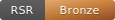

image:https://img.shields.io/badge/License-MPL_2.0-blue.svg[MPL-2.0-or-later,link="https://opensource.org/licenses/MPL-2.0"]
image:https://img.shields.io/badge/Philosophy-Palimpsest-indigo.svg[Palimpsest,link="https://github.com/hyperpolymath/palimpsest-license"]

// SPDX-License-Identifier: MPL-2.0-or-later
// SPDX-FileCopyrightText: 2024 RSR-Certified Contributors

= RSR-Certified
:author: RSR-Certified Contributors
:version: 0.1.0
:toc: macro
:toclevels: 2
:icons: font
:source-highlighter: rouge

*Universal Rhodium Standard Repository Compliance Engine*

image:https://img.shields.io/badge/rust-1.75+-orange.svg[Rust Version]

[.lead]
One compliance engine. Every git platform. Universal repository excellence.

toc::[]

== What is RSR-Certified?

RSR-Certified is a **universal repository compliance engine** that implements the https://gitlab.com/hyperpolymath/rhodium-standard-repositories[Rhodium Standard Repository (RSR)] certification framework. It provides automated compliance checking across GitHub, GitLab, Bitbucket, Gitea/Forgejo, and more.

=== Key Features

[cols="1,3"]
|===
|Feature |Description

|**Universal Platform Support**
|Single engine works with GitHub, GitLab, Bitbucket, Gitea, Forgejo

|**Tiered Certification**
|Bronze, Silver, Gold, and Rhodium compliance levels

|**CLI Tool**
|Check repository compliance locally before pushing

|**Webhook Server**
|Automatic compliance checks on push/PR events

|**LSP Integration**
|Real-time compliance feedback in VS Code, Neovim, Emacs

|**Badge Generation**
|Display your certification proudly in your README

|**Containerized**
|Run anywhere with Podman or Docker
|===

== Certification Tiers

[cols="1,1,3,1"]
|===
|Tier |Symbol |Requirements |Badge

|**Rhodium**
|`*` RSR-Rh
|Full compliance + SBOM + SLSA + reproducible builds + threat model
|

|**Gold**
|`*` RSR-Au
|Full compliance + documentation + test coverage + security scanning
|

|**Silver**
|`*` RSR-Ag
|Core compliance + CONTRIBUTING + CI/CD + SECURITY + changelog
|

|**Bronze**
|`*` RSR-Cu
|LICENSE + README + .gitignore + no hardcoded secrets
|
|===

== Quick Start

=== Check a Local Repository

[source,bash]
----
# Install from source
git clone https://github.com/Hyperpolymath/git-rsr-certified
cd git-rsr-certified
cargo build --release

# Check compliance
./target/release/rsr check /path/to/your/repo

# Initialize RSR configuration
./target/release/rsr init --tier silver /path/to/your/repo
----

=== Run the Webhook Server

[source,bash]
----
# Start server on port 8080
./target/release/rsr serve --host 0.0.0.0 --port 8080 --platforms github,gitlab

# Or use containers
cd container && podman-compose up -d
----

=== Generate a Badge

[source,bash]
----
# Output badge SVG to stdout
./target/release/rsr badge silver

# Save to file
./target/release/rsr badge gold --output badge.svg
----

== Architecture

[source]
----
+---------------------------------------------------------------+
|                    RSR-CERTIFIED ENGINE                        |
+---------------------------------------------------------------+
|  GitHub  |  GitLab  |  Bitbucket  |  Gitea/Forgejo            |
|    |         |           |              |                      |
|    +----+----+----+------+------+-------+                      |
|              |                                                 |
|    +---------v---------+                                       |
|    | Universal Event   |                                       |
|    |    Translator     |                                       |
|    +---------+---------+                                       |
|              |                                                 |
|    +---------v---------+                                       |
|    |   RSR Compliance  |<-----+                                |
|    |      Engine       |      |                                |
|    +---------+---------+      |                                |
|              |                |                                |
|    +---------+--------+-------+-------+                        |
|    |         |                |       |                        |
| +--v---+ +---v----+  +--------v----+  |                        |
| |Badge | |Reports |  | IDE/LSP     |  |                        |
| |Gen   | |        |  | Integration |  |                        |
| +------+ +--------+  +-------------+  |                        |
+---------------------------------------------------------------+
----

== Project Structure

[source]
----
git-rsr-certified/
|-- engine/                    # Core compliance engine (Rust)
|   |-- src/
|   |   |-- lib.rs            # Library root
|   |   |-- main.rs           # CLI entry point
|   |   |-- compliance/       # Tier check implementations
|   |   |   |-- bronze.rs     # LICENSE, README, .gitignore, secrets
|   |   |   |-- silver.rs     # CONTRIBUTING, CI, SECURITY
|   |   |   |-- gold.rs       # Docs, coverage, scanning
|   |   |   +-- rhodium.rs    # SBOM, SLSA, reproducible builds
|   |   |-- adapters/         # Platform adapters
|   |   |   |-- github.rs     # GitHub (fully implemented)
|   |   |   |-- gitlab.rs     # GitLab (scaffolded)
|   |   |   |-- bitbucket.rs  # Bitbucket (scaffolded)
|   |   |   +-- gitea.rs      # Gitea/Forgejo (scaffolded)
|   |   |-- events/           # Event abstraction layer
|   |   +-- server/           # HTTP webhook server
|   +-- Cargo.toml
|
|-- lsp/                       # Language Server Protocol server
|   |-- src/main.rs           # LSP implementation
|   +-- Cargo.toml
|
|-- extensions/                # IDE extensions
|   +-- vscode/               # VS Code extension
|
|-- container/                 # Container deployment
|   |-- Containerfile         # Podman/Docker build
|   |-- compose.yml           # Compose orchestration
|   +-- k8s/                  # Kubernetes manifests
|
|-- badges/                    # Badge SVG assets
|-- schemas/                   # JSON schemas for configuration
+-- docs/                      # Additional documentation
----

== Configuration

Create `.rsr.toml` in your repository root:

[source,toml]
----
[compliance]
target_tier = "gold"
strict_mode = false

[checks]
license.required = true
license.allowed = ["MIT", "Apache-2.0", "GPL-3.0"]
readme.min_length = 100

[ignore]
paths = ["vendor/", "node_modules/", "third_party/"]

[badges]
style = "flat-square"
include_score = true

[ci]
fail_on = "bronze"
comment_on_pr = true
----

== API Reference

=== CLI Commands

[cols="2,4"]
|===
|Command |Description

|`rsr check <path>`
|Check compliance of a local repository

|`rsr serve`
|Start the webhook server

|`rsr badge <tier>`
|Generate a compliance badge

|`rsr init`
|Initialize `.rsr.toml` configuration
|===

=== REST Endpoints

[cols="2,4"]
|===
|Endpoint |Description

|`POST /webhook/{platform}`
|Receive platform webhooks

|`GET /api/v1/repo/{owner}/{repo}/status`
|Get compliance status

|`GET /api/v1/repo/{owner}/{repo}/badge`
|Get badge SVG

|`GET /api/v1/repo/{owner}/{repo}/report`
|Get detailed report

|`GET /health`
|Health check

|`GET /metrics`
|Prometheus metrics
|===

=== LSP Methods

[cols="2,4"]
|===
|Method |Description

|`rsr/getCompliance`
|Get current compliance status

|`rsr/runCheck`
|Run specific compliance check

|`rsr/getTier`
|Get current certification tier

|`rsr/suggestFixes`
|Get fix suggestions for failures
|===

== IDE Integration

=== VS Code

Install the RSR-Certified extension from the marketplace or build from source:

[source,bash]
----
cd extensions/vscode
npm install
npm run build
----

=== Neovim / Vim

Use any LSP client with the `rsr-lsp` binary:

[source,lua]
----
-- lua/lspconfig example
require('lspconfig').rsr.setup{
  cmd = { "rsr-lsp" },
  filetypes = { "toml", "markdown", "yaml" },
}
----

=== Emacs

Configure with `lsp-mode` or `eglot`:

[source,elisp]
----
(with-eval-after-load 'lsp-mode
  (add-to-list 'lsp-language-id-configuration '(toml-mode . "rsr"))
  (lsp-register-client
   (make-lsp-client :new-connection (lsp-stdio-connection "rsr-lsp")
                    :activation-fn (lsp-activate-on "rsr")
                    :server-id 'rsr-lsp)))
----

== Container Deployment

=== Podman / Docker

[source,bash]
----
# Build the image
podman build -t rsr-certified:latest -f container/Containerfile .

# Run the server
podman run -p 8080:8080 \
  -e RSR_PLATFORMS=github,gitlab \
  -e RSR_LOG_LEVEL=info \
  rsr-certified:latest
----

=== Compose

[source,bash]
----
cd container
podman-compose up -d
----

=== Kubernetes

[source,bash]
----
kubectl apply -f container/k8s/deployment.yaml
----

== Compliance Checks Reference

=== Bronze Tier

[cols="2,4,1"]
|===
|Check ID |Description |Status

|`bronze.license`
|Valid LICENSE file present
|Implemented

|`bronze.readme`
|README with minimum content
|Implemented

|`bronze.gitignore`
|.gitignore with patterns
|Implemented

|`bronze.no_secrets`
|No hardcoded secrets (API keys, tokens, private keys)
|Implemented
|===

=== Silver Tier

[cols="2,4,1"]
|===
|Check ID |Description |Status

|`silver.contributing`
|CONTRIBUTING.md present
|Planned

|`silver.code_of_conduct`
|CODE_OF_CONDUCT.md present
|Planned

|`silver.security_policy`
|SECURITY.md present
|Planned

|`silver.changelog`
|CHANGELOG maintained
|Planned

|`silver.ci_config`
|CI/CD configuration present
|Planned

|`silver.issue_templates`
|Issue/PR templates
|Planned
|===

=== Gold Tier

[cols="2,4,1"]
|===
|Check ID |Description |Status

|`gold.documentation`
|API/Architecture docs
|Planned

|`gold.test_coverage`
|Minimum 70% coverage
|Planned

|`gold.dependency_scanning`
|Vulnerability scanning
|Planned

|`gold.signed_commits`
|GPG/SSH signing
|Planned
|===

=== Rhodium Tier

[cols="2,4,1"]
|===
|Check ID |Description |Status

|`rhodium.reproducible_builds`
|Nix/Guix reproducibility
|Planned

|`rhodium.sbom`
|Software Bill of Materials
|Planned

|`rhodium.slsa`
|SLSA Level 2+ compliance
|Planned

|`rhodium.threat_model`
|THREAT_MODEL.md
|Planned
|===

== Roadmap

See link:ROADMAP.adoc[ROADMAP.adoc] for the detailed development roadmap.

=== Current Focus (v0.1.0)

* Bronze tier checks (complete)
* GitHub adapter (complete)
* CLI and webhook server (complete)
* LSP baseline (complete)

=== Next Milestone (v0.2.0)

* Silver tier checks
* Badge service
* VS Code extension MVP
* GitLab adapter

== Contributing

See link:CONTRIBUTING.md[CONTRIBUTING.md] for contribution guidelines.

We follow the RSR Tri-Perimeter Contribution Framework:

* **Perimeter 1 (Core)**: Engine architecture, security
* **Perimeter 2 (Expert)**: New compliance checks, adapters
* **Perimeter 3 (Community)**: Documentation, tests, proposals

== Security

See link:SECURITY.md[SECURITY.md] for our security policy and vulnerability reporting process.

== License

Dual-licensed under link:LICENSE-MIT[MIT] or link:LICENSE-APACHE[Apache-2.0] at your option.

---

[.text-center]
*RSR-Certified* - Raising the bar for repository excellence, everywhere.
