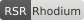

// SPDX-License-Identifier: CC-BY-SA-4.0
// SPDX-FileCopyrightText: 2024-2025 hyperpolymath

= RSR Compliance Tiers
:author: hyperpolymath
:revnumber: 1.0.0
:revdate: 2025-12-27
:toc: left
:icons: font

[NOTE]
====
*Version Status*: v1.0.0 *FROZEN* — Tier thresholds and requirements are immutable.
====

== Overview

RSR defines four compliance tiers, each building on the previous. Projects display badges indicating their current tier.

== Tier Definitions

=== Bronze (75-89%)

*Minimum viable RSR compliance.*

.Required
* [ ] README.md or README.adoc
* [ ] LICENSE.txt (SPDX-identified)
* [ ] SECURITY.md with vulnerability policy
* [ ] CI/CD pipeline (GitLab or GitHub Actions)
* [ ] SPDX headers on all source files
* [ ] .gitignore and .gitattributes

.Recommended
* [ ] CODE_OF_CONDUCT.md
* [ ] CONTRIBUTING.md

=== Silver (90-99%)

*Professional-grade compliance.*

.Includes all Bronze requirements, plus:
* [ ] CODE_OF_CONDUCT.adoc
* [ ] CONTRIBUTING.adoc
* [ ] GOVERNANCE.adoc
* [ ] MAINTAINERS.md
* [ ] FUNDING.yml
* [ ] OpenSSF Scorecard >= 7.0
* [ ] SHA-pinned GitHub Actions
* [ ] .well-known/ directory with security.txt

=== Gold (100%)

*Full RSR compliance.*

.Includes all Silver requirements, plus:
* [ ] `.machine_readable/6a2/STATE.a2ml` - Project state tracking
* [ ] `.machine_readable/6a2/META.a2ml` - Architecture decisions
* [ ] `.machine_readable/6a2/ECOSYSTEM.a2ml` - Project relationships
* [ ] `.machine_readable/6a2/AGENTIC.a2ml` - AI agent constraints
* [ ] `.machine_readable/6a2/NEUROSYM.a2ml` - Neurosymbolic integration config
* [ ] `.machine_readable/6a2/PLAYBOOK.a2ml` - Operational runbook
* [ ] OpenSSF Scorecard >= 9.0
* [ ] All 11 compliance categories passing
* [ ] .well-known/ai.txt, humans.txt, provenance.json
* [ ] Nix flake or Guix package definition

NOTE: The estate migrated from Guile Scheme (STATE.scm, META.scm, ECOSYSTEM.scm) to
A2ML format (STATE.a2ml, META.a2ml, ECOSYSTEM.a2ml) on 2026-04-12. Legacy .scm files
are deprecated.

=== Rhodium (100% + Exemplary)

*Exemplary status beyond Gold.*

.Includes all Gold requirements, plus:
* [ ] Formal verification (SPARK, Coq, Isabelle)
* [ ] Community recognition as reference implementation
* [ ] Contributions back to RSR standard
* [ ] Published security audits
* [ ] CRDT-based state management

== Scoring Calculation

Compliance score is calculated as:

[source]
----
score = (passed_criteria / total_applicable_criteria) * 100
----

See link:../spec.scm/tiers.scm[spec.scm/tiers.scm] for machine-readable tier definitions (legacy Guile Scheme format; A2ML migration pending).

== Badge Usage

=== Markdown

[source,markdown]
----

----

=== AsciiDoc

[source,asciidoc]
----
image:https://raw.githubusercontent.com/hyperpolymath/rhodium-standard-repositories/main/badges/rsr-gold.svg[RSR Gold]
----

=== shields.io

[source,markdown]
----

----
