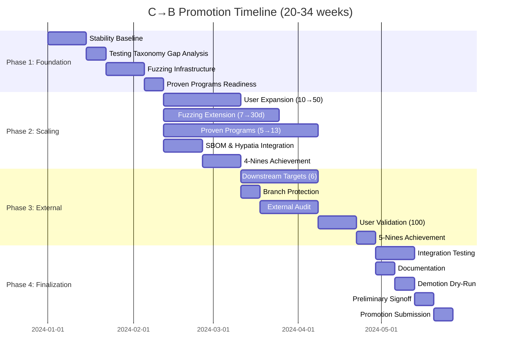
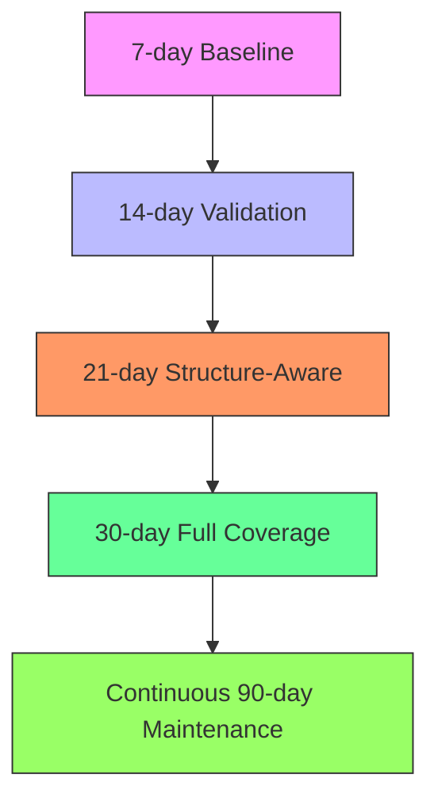
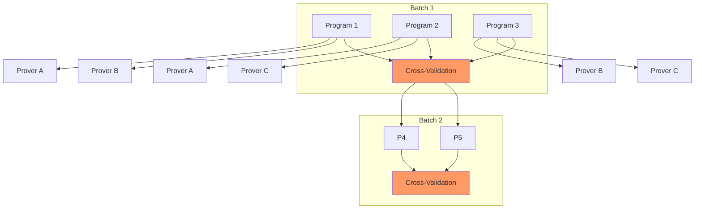
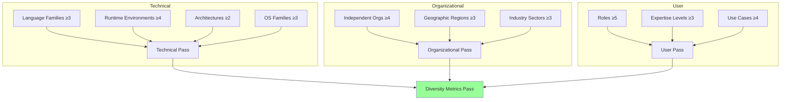

# C to B Promotion: Visual Guide

## Subsystem Flowcharts

### Fuzzing Progression

### Proven Programs Pipeline

### Diversity Metrics Validation

## Versioning

**Document Version:** 1.0.0
**Last Updated:** 2026-04-15
**Status:** Active

### Version History

| Version | Date       | Changes | Author |
|---------|------------|---------|--------|
| 1.0.0   | 2026-04-15 | Initial creation with Mermaid diagrams and versioning section | Mistral Vibe |

### Change Control

1. **Minor Updates** (diagram improvements, typo fixes):
   - May be committed directly to main branch
   - Require PR review by at least one maintainer
   
2. **Major Updates** (structural changes, new subsystems):
   - Require RFC process
   - Must maintain backward compatibility
   - Require unanimous maintainer approval

### Compatibility

- **Mermaid Version:** Compatible with Mermaid.js 10.0+
- **Diagram Types:** gantt, flowchart
- **Rendering:** Tested with GitHub Markdown, VS Code Mermaid plugin

### Maintenance

- **Review Cycle:** Quarterly
- **Next Review:** 2026-07-15
- **Deprecation Policy:** 12 months notice for major changes

## Integration Notes

1. **CRG Alignment:** This guide complements CRG Grade B requirements
2. **K9 Automation:** See `automation-hooks` section for K9 integration points
3. **RSR Compliance:** All phases assume RSR-FULL (Gold) compliance
4. **Demotion Triggers:** Phase 4 includes demotion procedure validation